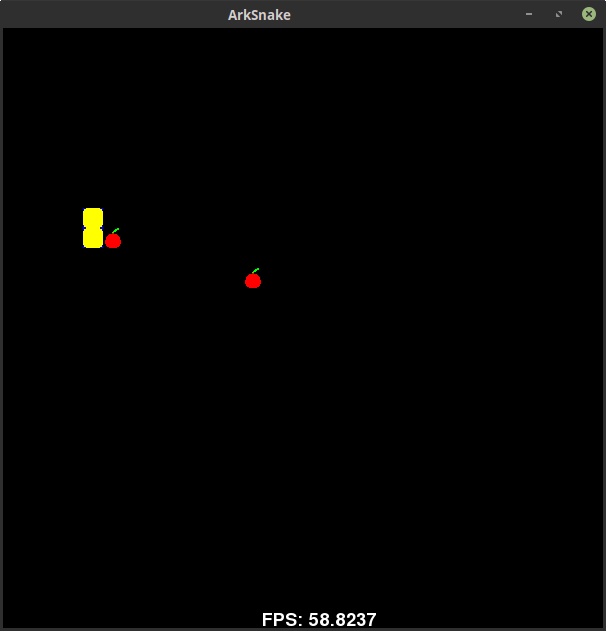

# ArkScript  

[](https://app.codacy.com/app/folaefolc/Ark?utm_source=github.com&utm_medium=referral&utm_content=SuperFola/Ark&utm_campaign=Badge_Grade_Settings)
[](https://travis-ci.org/ArkScript-lang/Ark)


Discord server: [invite link](https://discord.gg/YT5yDwn), to discuss the specification of the language and receive help

**Nota bene**: the project is referred as "Ark" and as "ArkScript". The official public name is "ArkScript" since "Ark" is already being used by [another language](https://github.com/ark-lang/ark)

## Key features

ArkScript is
* small: the compiler, and the virtual machines fit under 5000 lines, but also small in term of keywords (it has only 10)!
* a scripting language: it's very easy to embed it in your application. The builtin construction is quite easy to understand, so adding your own functions to the virtual machine is effortless
* portable: it produces a bytecode which is run by its virtual machine, like Java but without the `OutOfMemoryException`
* a functional language: every parameter is passed by value, everything is immutable unless you use `mut` to define a mutable variable
* powerful: it can handle object oriented programming in a very elegant way with its closures and explicit captures (see examples/church-encoding)
* promoting functionalities before performances: expressiveness often brings more productivity, but performances aren't bad at all
* easy to compile: it takes less than 200ms to compile and check a complex code with a lot of branches and sub-branches of 200 lines.
* a Lisp-like, but with less parentheses: `[...]` is expanded to `(list ...)` and `{}` to `(begin ...)`. More shorthands will come in the future.
* extensible: it is very easy to create a C++ module to use in the language

Also:
* it has a REPL
* it has a growing standard library, composed of ArkScript (under `lib/`) and C++ (under `modules/`)
* it has a lot of unit tests, which are ran before every release to ensure everything work as intended

## Examples

### Fibonacci suite

```clojure
{
    (let fibo (fun (n)
        (if (< n 2)
            n
            (+ (fibo (- n 1)) (fibo (- n 2))))))

    (print (fibo 28))  # display 317811
}
```

## More or less game

```clojure
{
    # more or less game
    (print "More or less game!")

    (import "random.bin")
    (import "Math/Arithmetic.ark")

    (let number (mod (abs (random)) 10000))
    (mut value 0)
    (mut essais 0)

    (mut continue true)

    (while continue {
        (set value (toNumber (input "Input a numeric value: ")))

        (if (< value number)
            # then
            (print "More!")
            # else
            (if (= value number)
                # then
                { (print "Bingo!") (set continue false) }
                # else
                (print "Less!")))

        (set essais (+ 1 essais))})

    (print "You won in " essais " tries")
}
```

More examples are available in the folder `examples/`.

## Performances

<!-- don't forget to update the benchmarks -->

Compiled on WSL (Ubuntu 18.04.3 LTS 64 bits), 125 runs of each test.

Running on 8 X 1992 MHz CPU
CPU Caches:
* L1 Data 32K (x4)
* L1 Instruction 32K (x4)
* L2 Unified 262K (x4)
* L3 Unified 8388K (x1)

Programs used:
* C++: g++ 8.3.0
* Java: OpenJDK 11.0.6 64 bits
* Lua: Lua 5.1.5
* Python: Python 3.6.9
* JavaScript: SpiderMonkey on Firefox 74

### Ackermann Péter test

The Ackermann function, due to its definition in terms of extremely deep recursion, can be used as a benchmark of a compiler's ability to optimize recursion.

Parameters used are m=3 and n=6.

| data   | ArkScript | C++      | Java     | Lua      | Python    | JavaScript |
| ------ | --------- | -------- | -------- | -------- | --------- | ---------- |
| mean   | 50.9 ms   | 0.152 ms | 0.152 ms | 4.750 ms | 15.334 ms | 19.76 ms   |
| median | 50.7 ms   | 0.144 ms | 0 ms     | 4.666 ms | 13.095 ms | 20 ms      |
| stddev | 1.81 ms   | 0.012 ms | 0.359 ms | 0.253 ms | 5.068 ms  | 1.046 ms   |

### List allocation test

Allocating list of 1000 elements (all numbers, only 0).

| data   | ArkScript  | C++         | Java      | Lua       | Python     | JavaScript |
| ------ | ---------- | ----------- | --------- | --------- | ---------- | ---------- |
| mean   | 0.017 ms   | 0.000618 ms | 0.016 ms  | 0.1647 ms | 0.00325 ms | 0.016 ms   |
| median | 0.016 ms   | 0.000586 ms | 0 ms      | 0.1649 ms | 0.0024 ms  | 0 ms       |
| stddev | 0.001 ms   | 0.000097 ms | 0.1254 ms | 0.0813 ms | 0.00339 ms | 0.125 ms   |

## Contributing

* First, [fork](https://github.com/ArkScript-lang/Ark/fork) the repository
* Then, clone your fork: `git clone git@github.com:username/Ark.git`
* Create a branch for your feature: `git checkout -b feat-my-awesome-idea`
* When you're done, push it to your fork and submit a pull request!

Don't know what to work on? No worries, we have a [list of things to do](https://github.com/ArkScript-lang/Ark/projects) :wink:

### Our beloved contributors

Who worked on
* the standard library
    * [@SuperFola](https://github.com/SuperFola)
    * [@Natendrtfm](https://github.com/Natendrtfm)
    * [@rinz13r](https://github.com/rinz13r)
    * [@FrenchMasterSword](https://github.com/FrenchMasterSword)
    * [@rstefanic](https://github.com/rstefanic)
* the builtins
    * [@SuperFola](https://github.com/SuperFola)
    * [@rinz13r](https://github.com/rinz13r)
* the REPL
    * [@rstefanic](https://github.com/rstefanic)
* the CLI
    * [@SuperFola](https://github.com/SuperFola)
    * [@DontBelieveMe](https://github.com/DontBelieveMe)
* the documentation
    * [@SuperFola](https://github.com/SuperFola)
    * [@OfficePop](https://github.com/OfficePop)
* the language specification
    * [@SuperFola](https://github.com/SuperFola)
    * [@FrenchMasterSword](https://github.com/FrenchMasterSword)
* the logo
    * [Ma15fo43](https://github.com/Ma15fo43)

### Contributing to the ArkScript standard library

For performance reasons, some functions might be written in C++, in `include/Ark/Builtins/Builtins.hpp` and `src/Builtins/`.

### Code structure


## Dependencies

* C++17
* CMake >= 3.12
* Visual Studio >= 11 (on Windows)
* On macOS versions prior to 10.15, `libc++` lacks `filesystem` in the standard library.
    * Install a newer compiler using [Homebrew](https://docs.brew.sh/): `brew install gcc && brew link gcc`
    * Pass compiler path to `cmake` in the build step: `-DCMAKE_CXX_COMPILER=/usr/local/bin/g++-9`

Libs already included:
* [CLIPP](https://github.com/muellan/clipp), MIT licence
* [termcolor](https://github.com/ikalnytskyi/termcolor), BSD (3-clause) licence

## Building

```bash
# first, clone it
~$ git clone --depth=50 --branch=dev https://github.com/ArkScript-lang/Ark.git
~/Ark$ cd Ark
~/Ark$ git submodule update --init --recursive
# building Ark
~/Ark$ cmake -H. -Bbuild -DCMAKE_BUILD_TYPE=Release -DARK_BUILD_EXE=1
~/Ark$ cmake --build build
# installing Ark (might need administrative privileges)
~/Ark$ cmake --install build --config Release
# running
~/Ark$ Ark --help
DESCRIPTION
        ArkScript programming language

SYNOPSIS
        Ark -h, --help
        Ark --version
        Ark --dev-info
        Ark ((<file> [-c]) | -r) [-(d|bcr)] [-L <lib_dir>] [-f(fac|no-fac)] [-f(aitap|no-aitap)]

OPTIONS
        -h, --help                  Display this message
        --version                   Display ArkScript version and exit
        --dev-info                  Display development information and exit
        -c, --compile               Compile the given program to bytecode, but do not run
        -r, --repl                  Run the ArkScript REPL
        -d, --debug...              Increase debug level (default: 0)
        -bcr, --bytecode-reader     Launch the bytecode reader
        -L, --lib                   Set the location of the ArkScript standard library
        -f(fac|no-fac)              Toggle function arity checks (default: ON)
        -f(aitap|no-aitap)          Authorize invalid token after `(' (default: OFF). When ON, only display a warning

LICENSE
        Mozilla Public License 2.0
```

## Games

You can find a snake created in ArkScript in the folder examples/games/snake (run it from there, otherwise it won't find the font and the sprites ; you won't need to install the SFML).



Controls are the arrows (left, right, up and down), the game closes itself when you successfully collect the 3 apples.

## Credits

This project was inspired by [gameprogramingpatterns](http://gameprogrammingpatterns.com/bytecode.html) and [ofan lisp.cpp](https://gist.github.com/ofan/721464)

## Copyright and Licence information

Copyright (c) 2019-2020 Alexandre Plateau. All rights reserved.

This ArkScript distribution contains no GNU GPL code, which means it can be used in proprietary projects.